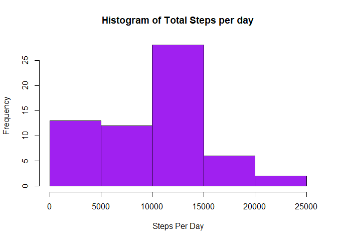
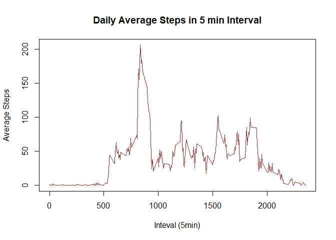
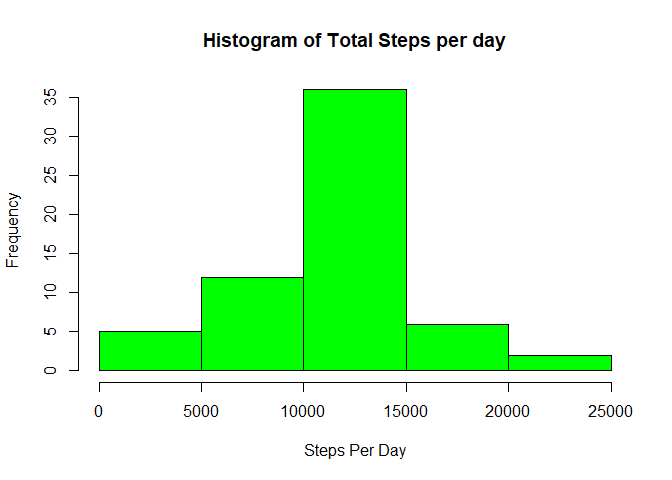
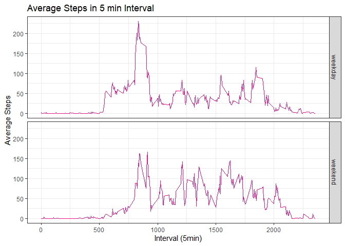

### A project or assignment of week 2 of Reproducible Research on Coursera

This assignment makes use of data from a personal activity monitoring device. This device collects data at 5 minute intervals through out the day. The data consists of two months of data from an anonymous individual collected during the months of October and November, 2012 and include the number of steps taken in 5 minute intervals each day.

[Data Downloding link](https://d396qusza40orc.cloudfront.net/repdata%2Fdata%2Factivity.zip)

## \
### Data description

The variables included in this dataset are:

1. **steps**: Number of steps taking in a 5-minute interval (missing values are coded as NA)
2. **date**: The date on which the measurement was taken in YYYY-MM-DD format  
3.**interval**: Identifier for the 5-minute interval in which measurement was taken

The dataset is stored in a comma-separated-value (CSV) file and there are a total of 17,568 observations in this dataset.

## \ 
## Loading and preprocessing the data


```r
activity <- read.csv('./repdata_data_activity/activity.csv')
str(activity)
```

```
## 'data.frame':	17568 obs. of  3 variables:
##  $ steps   : int  NA NA NA NA NA NA NA NA NA NA ...
##  $ date    : chr  "2012-10-01" "2012-10-01" "2012-10-01" "2012-10-01" ...
##  $ interval: int  0 5 10 15 20 25 30 35 40 45 ...
```

```r
activity$date <- lubridate::ymd(activity$date) #date format
summary(activity)
```

```
##      steps             date               interval     
##  Min.   :  0.00   Min.   :2012-10-01   Min.   :   0.0  
##  1st Qu.:  0.00   1st Qu.:2012-10-16   1st Qu.: 588.8  
##  Median :  0.00   Median :2012-10-31   Median :1177.5  
##  Mean   : 37.38   Mean   :2012-10-31   Mean   :1177.5  
##  3rd Qu.: 12.00   3rd Qu.:2012-11-15   3rd Qu.:1766.2  
##  Max.   :806.00   Max.   :2012-11-30   Max.   :2355.0  
##  NA's   :2304
```
### Head and Tail of data

```r
head(activity,3)
```

```
##   steps       date interval
## 1    NA 2012-10-01        0
## 2    NA 2012-10-01        5
## 3    NA 2012-10-01       10
```

```r
tail(activity,3)
```

```
##       steps       date interval
## 17566    NA 2012-11-30     2345
## 17567    NA 2012-11-30     2350
## 17568    NA 2012-11-30     2355
```


## \ 
## What is mean total number of steps taken per day?

## \ 
### 1.Calculate the total number of steps taken per day


```r
library(dplyr)
```

```
## 
## Attaching package: 'dplyr'
```

```
## The following objects are masked from 'package:stats':
## 
##     filter, lag
```

```
## The following objects are masked from 'package:base':
## 
##     intersect, setdiff, setequal, union
```

```r
TotalSteps <- group_by(activity,date) %>% summarise(StepsPerDay = sum(steps,na.rm = TRUE))
```

```
## `summarise()` ungrouping output (override with `.groups` argument)
```

```r
TotalSteps
```

```
## # A tibble: 61 x 2
##    date       StepsPerDay
##    <date>           <int>
##  1 2012-10-01           0
##  2 2012-10-02         126
##  3 2012-10-03       11352
##  4 2012-10-04       12116
##  5 2012-10-05       13294
##  6 2012-10-06       15420
##  7 2012-10-07       11015
##  8 2012-10-08           0
##  9 2012-10-09       12811
## 10 2012-10-10        9900
## # ... with 51 more rows
```

## \ 
### 2. Make a histogram of the total number of steps taken each day


```r
hist(TotalSteps$StepsPerDay, main = 'Histogram of Total Steps per day',xlab = 'Steps Per Day', col = 'purple')
```

<!-- -->

```r
dev.copy(png,'./instructions_fig/plot1hist(StepsPerDay).png')
```

```
## png 
##   3
```

```r
dev.off()
```

```
## png 
##   2
```
 
## \  
### 3.Calculate and report the mean and median of the total number of steps taken per day


```r
Mean <- mean(TotalSteps$StepsPerDay)
Median <- median(TotalSteps$StepsPerDay)
```

- The mean of total steps of pre day is : **9354.2295082**
- The median of total steps of pre day is : **10395**  
  
## \
## What is the average daily activity pattern?
  
### 1.Make a time series plot (i.e. type = "l") of the 5-minute interval (x-axis) and the average number of steps taken, averaged across all days (y-axis)


```r
MeanData <- activity %>% group_by(interval) %>% summarise(MeanSteps = mean(steps, na.rm = TRUE))
```

```
## `summarise()` ungrouping output (override with `.groups` argument)
```

```r
with(MeanData, plot(interval, MeanSteps, type = 'l', xlab = 'Inteval (5min)', ylab = 'Average Steps', col = 'Brown'))
title(main = 'Daily Average Steps in 5 min Interval')
```

<!-- -->

```r
dev.copy(png,'./instructions_fig/plot2(AverageSteps).png')
```

```
## png 
##   3
```

```r
dev.off()
```

```
## png 
##   2
```
  
## \ 
### 2.Which 5-minute interval, on average across all the days in the dataset, contains the maximum number of steps?
  

```r
Max <- max(MeanData$MeanSteps)
MaxInterval <- MeanData[MeanData$MeanSteps == Max,][1]
```

Average maximum steps is **206.1698113** and corresponding 5 min interval for Average maximum  steps is **830 - **  **835** 

## \
# Imputing missing values

Note that there are a number of days/intervals where there are missing values (coded as NA). The presence of missing days may introduce bias into some calculations or summaries of the data.

### 1.Calculate and report the total number of missing values in the dataset (i.e. the total number of rows with NAs)


```r
Na <- sum(is.na(activity$steps))
NaPercent <- mean(is.na(activity$steps))*100
```

There are **2304** of missing data in activity(Steps) data ; whose percentage in data is about **13.1147541**%

# \
### 2.Devise a strategy for filling in all of the missing values in the dataset. The strategy does not need to be sophisticated. For example, you could use the mean/median for that day, or the mean for that 5-minute interval, etc.

I am using mean over a interval for imputation of missing values ,as for some dates there were only missing values and not any other values so there won't be any mean for that day.
Note that the missing values are only present in Steps column of Data; so we only focus on replacing Steps missing value
MeanIntervalData  is her data frame of mean of steps in an intrval  


```r
MeanIntervalData <- activity %>% group_by(interval) %>% summarise(mean = mean(steps,na.rm = TRUE))
```

```
## `summarise()` ungrouping output (override with `.groups` argument)
```

```r
MeanIntervalData
```

```
## # A tibble: 288 x 2
##    interval   mean
##       <int>  <dbl>
##  1        0 1.72  
##  2        5 0.340 
##  3       10 0.132 
##  4       15 0.151 
##  5       20 0.0755
##  6       25 2.09  
##  7       30 0.528 
##  8       35 0.868 
##  9       40 0     
## 10       45 1.47  
## # ... with 278 more rows
```

# \
### 3.Create a new dataset that is equal to the original dataset but with the missing data filled in.


```r
ImputedData <- activity
indices <- which(is.na(ImputedData$steps))
for (i in indices) {
  TempInterval <- ImputedData$interval[i]
  ImputedData$steps[i] <-
    MeanIntervalData[MeanIntervalData$interval == TempInterval, ]$mean
}
head(ImputedData)
```

```
##       steps       date interval
## 1 1.7169811 2012-10-01        0
## 2 0.3396226 2012-10-01        5
## 3 0.1320755 2012-10-01       10
## 4 0.1509434 2012-10-01       15
## 5 0.0754717 2012-10-01       20
## 6 2.0943396 2012-10-01       25
```

## \
### 4.Make a histogram of the total number of steps taken each day and Calculate and report the mean and median total number of steps taken per day. Do these values differ from the estimates from the first part of the assignment? What is the impact of imputing missing data on the estimates of the total daily number of steps?


```r
DailySteps <- ImputedData %>% group_by(date) %>% summarise(StepsPerDay = sum(steps))
```

```
## `summarise()` ungrouping output (override with `.groups` argument)
```

```r
hist(DailySteps$StepsPerDay,main = 'Histogram of Total Steps per day',xlab = 'Steps Per Day', col = 'green')
```

<!-- -->

```r
dev.copy(png,'./instructions_fig/plot3hist(No Na).png')
```

```
## png 
##   3
```

```r
dev.off()
```

```
## png 
##   2
```

```r
FinalMean <- mean(DailySteps$StepsPerDay)
FinalMedian <- median(DailySteps$StepsPerDay)
```

- Now after imputation mean as increase by **1411.959171** from 9354.2295082 to 10766.1886792453 
And median increase by **371.1886792** form 10395 to 10766.1886792453

- After imputation you can notice the histogram looks more normalize distributed then previous histogram because frequency of 0 steps decreased

# \
# Are there differences in activity patterns between weekdays and weekends?

For this part the weekdays() function may be of some help here. Use the dataset with the filled-in missing values for this part.

### 1.Create a new factor variable in the dataset with two levels – “weekday” and “weekend” indicating whether a given date is a weekday or weekend day.

I have already converted 'date' column of activity to date type object in previous step
Let check what is the type of 'date' column in ImputedData : **Date** 


```r
ImputedData <- ImputedData %>% mutate(Day = factor(weekdays(ImputedData$date) %in% c('Saturday','Sunday'),labels = c( 'weekday','weekend'))) %>% group_by(Day,interval) %>% mutate(AverageSteps = mean(steps,))
```

I have considered Monday to Friday as Weekdays
Note that I added AverageSteps column to ImputedData for panel ploting in next steps

# \
### 2.Make a panel plot containing a time series plot (i.e. type = "l") of the 5-minute interval (x-axis) and the average number of steps taken, averaged across all weekday days or weekend days (y-axis). See the README file in the GitHub repository to see an example of what this plot should look like using simulated data.


```r
library(ggplot2)

g <- ggplot(ImputedData, aes(interval,AverageSteps))
g + geom_line(col = 'deeppink2') + facet_grid(Day~.) + labs(title = 'Average Steps in 5 min Interval') + labs(x = 'Interval (5min)', y = 'Average Steps') + theme_bw()
```

<!-- -->

```r
dev.copy(png,'./instructions_fig/plot4timeseries(Day).png')
```

```
## png 
##   3
```

```r
dev.off()
```

```
## png 
##   2
```

```r
WeekdayAverage <-  mean(ImputedData[ImputedData$Day == 'weekday',]$AverageSteps)
WeekendAverage <- mean(ImputedData[ImputedData$Day == 'weekend',]$AverageSteps)
```

- Weekdays average is : **35.6105812** 
- Weekendays average is : **42.3664013**

As you can see from data Weekends average steps is greater than the Weekdays average steps
